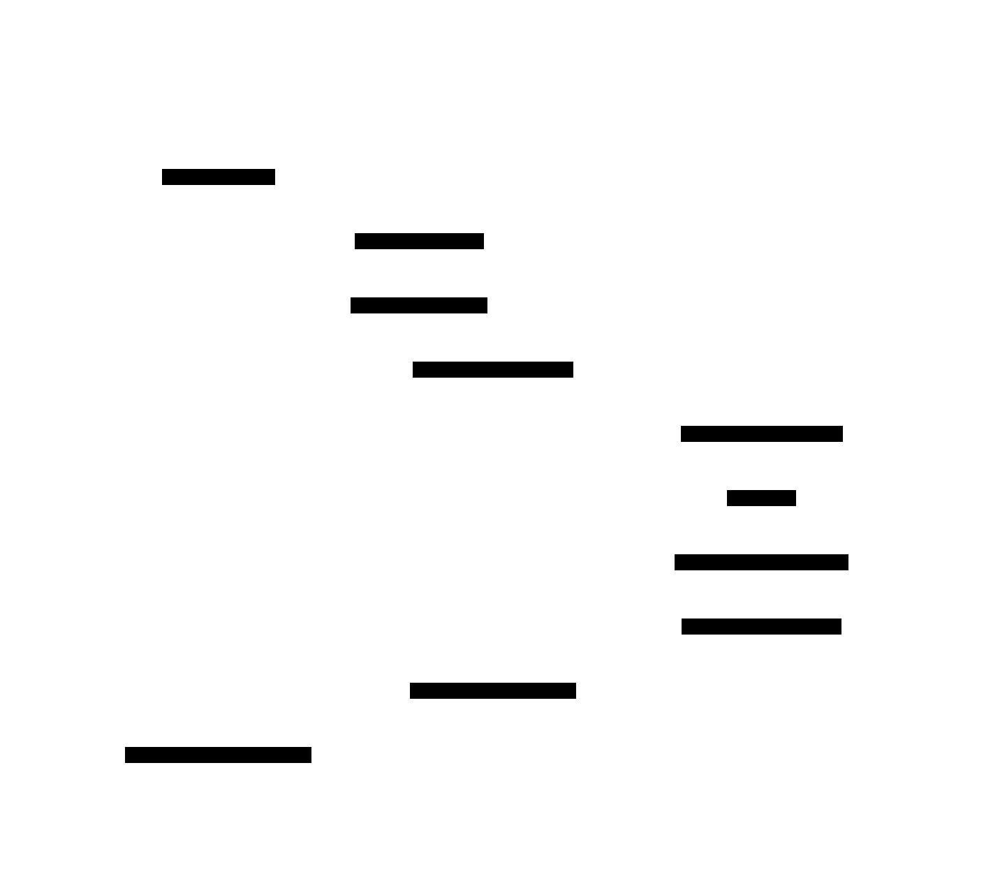

# Pattern matching

Pattern matching is the act of checking if a given expression matches a pattern.
For example, let's see this snippet of code:

```hs
describeNumber :: Int -> String
describeNumber 0 = "You entered exactly zero."
describeNumber x = "You entered a different number: " ++ show x
```

If we load that code into the `Interpreter` and evaluate the following expression:

```hs
describeNumber 0
```

It will match the two literal values because `0` is a [LiteralPattern](../ast/Patterns/LiteralPattern.md)

```text
[EnvBuilder] Defining function: `describeNumber`
[FunctionRuntime] Applying function: `describeNumber` with args: [ '0' ]
[FunctionRuntime] Trying to match value `0` with `0`
[FunctionRuntime] Match successful for `describeNumber` equation 0

You entered exactly zero.
```
But if we try with another string instead

```hs
describeNumber 10
```

The `Interpreter` will not match to `0`, instead it will **bind** `x -> 10` because `x` is a [VariablePattern](../ast/Patterns/VariablePattern.md) 

```text
[EnvBuilder] Defining function: `describeNumber`
[FunctionRuntime] Applying function: `describeNumber` with args: [ '10' ]
[FunctionRuntime] Trying to match value `10` with `0`
[FunctionRuntime] Could not match value `10` with `0`
[FunctionRuntime] Trying to match value `10` with `x`
[FunctionRuntime] Match successful for `describeNumber` equation 1

You entered a different number: 10
```

When the `FunctionRuntime` applies an expression to that function, the `PatternMatcher` tries each equation top-to-bottom until it finds the first that matches. In the second example, the catch-all variable `x` successfully matches the input and binds the value `10` so it can be used in the resulting expression.

## Evaluation Flow

The following sequence diagram illustrates the internal process runned by the `Interpreter` when it evaluates an expression that requires fallback pattern matching, such as `describeNumber 10`.



## See also


- [Wikipedia - Pattern matching](https://en.wikipedia.org/wiki/Pattern_matching)

- [The Haskell 98 Report - Pattern matching](https://www.haskell.org/onlinereport/exps.html#pattern-matching)
